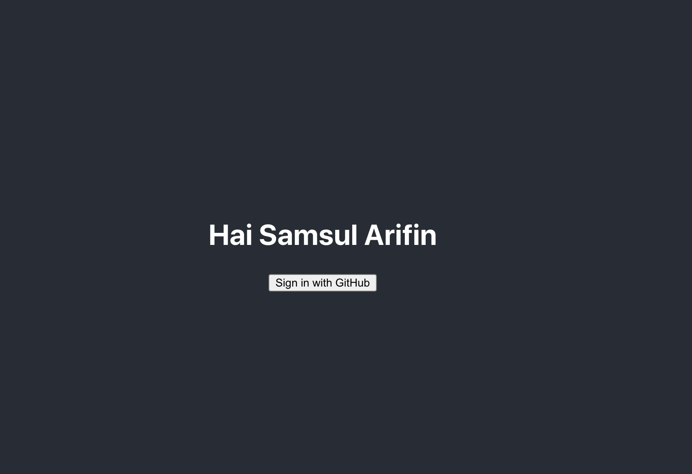

## Expected

## Problem

Bismillah, Saya sudah malukukan analisis pada aplikasi ini. Kemudian saya menemukan beberapa masalah antara lain :

- props scope seharusnya user saja.
- Kita harus mendaftarkan aplikasi ini di github dev untuk mendapatkan client id dan secret id
- Setalah proses login dengan github selesai, kita harus mendapatkan akses token untuk mendapatkan data user yang sudah login. Tapi disini saya mendapatkan problem cors, sebenernya saya pengen buat server tersediri untuk mengatasi ini. Tapi lagi lagi waktu menjadi penghalang.
- Ambil nama user yang sudah login dari response API
